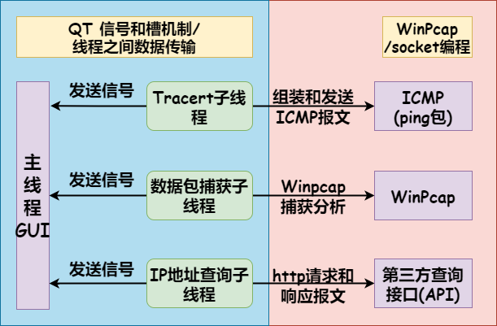

# Tracert
`Tracertplus`,`C++`开发`tracert`,带`GUI`

## Function

一共三个子线程，分别用于数据包捕获、`ICMP`数据包封装发送/接收(`Tracert`)、`HTTP`请求/响应(`IP`地址查询)。

系统框架设计图，查询接口使用的是第三方的接口，可能未来会失效。



## Demo


## Environment

```bash
Windows 10 / 11
MinGW-32-bit(QT)
```

## 注

在使用`Tracert`时，需要关闭`Windows defender`，或者设置允许`ICMP`流量通过，否则每一跳都是超时，可能被防火墙过滤掉了，但不影响你能够捕获到对应的`ICMP`报文。